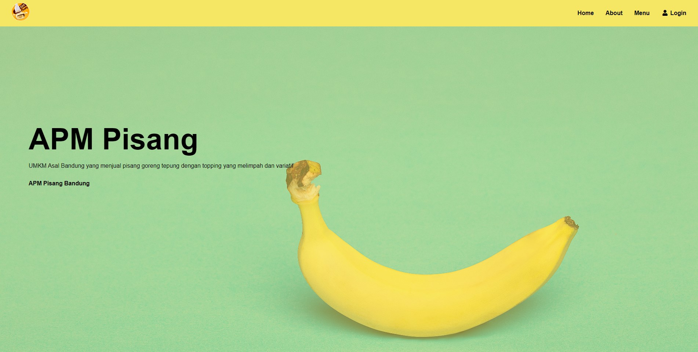

# Module 2 Ridzky Sulthan 

Selamat datang di website APM Pisang yang berisi tentang UMKM dari Bandung yang menjual produk olahan pisang menjadi cemilan.

## 🍌 Software & Tools 
| Software & Tools                                                                                                    |
|---------------------------------------------------------------------------------------------------------------------|
|            |
| 
<!--                | -->

## 🍌 Website APM Pisang

