
# Module 2 Ridzky Sulthan 

Selamat datang di website APM Pisang yang berisi tentang UMKM dari Bandung yang menjual produk olahan pisang menjadi cemilan.

## 🍌 Software & Tools 
| Software & Tools                                                                                                    |
|---------------------------------------------------------------------------------------------------------------------|
|            |
| 
<!--                | -->

# 🍌Deployment & Custom Domain
## Deployment

1. Open Netlify on this [link](https://netlify.com) and login
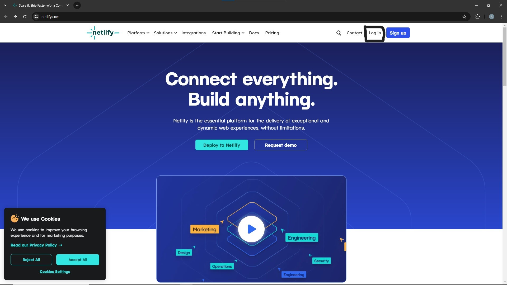

2. This is the initial view of netlify
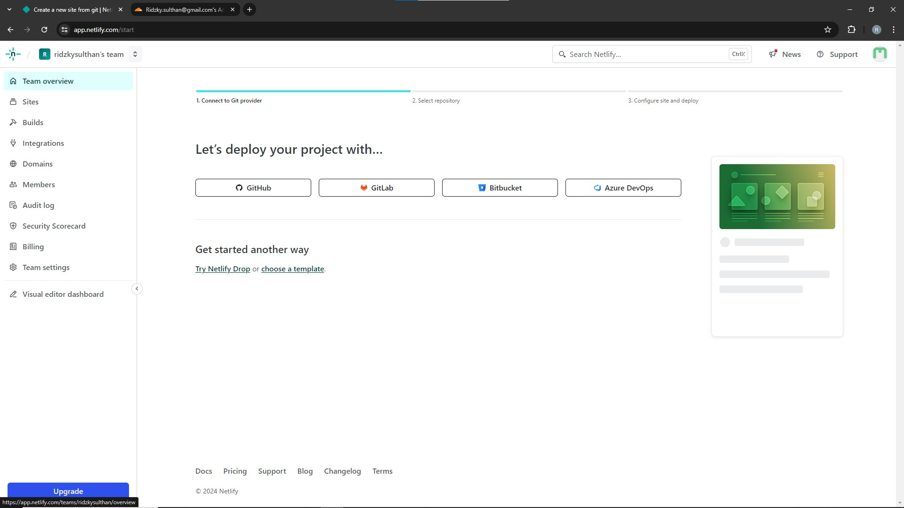

3. Choose your Github account on this feature
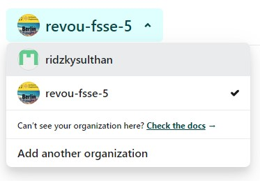

4. After that, search your repository with search bar
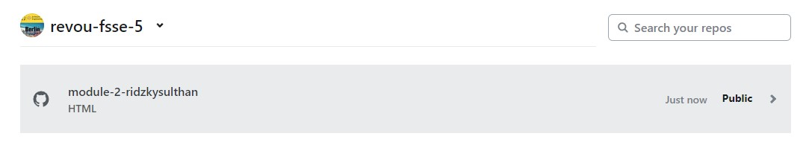

5. Your almost done, deploy your website with click 'deploy'
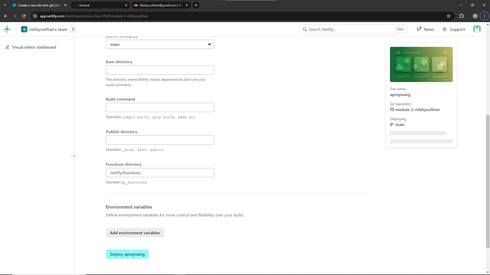

6. Congratulations!! your website is already deploy 🍌🍌
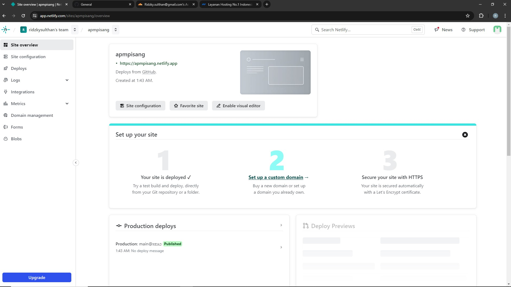

## Custom Domain
1. Open Netlify again on [here](https://netlify.com)
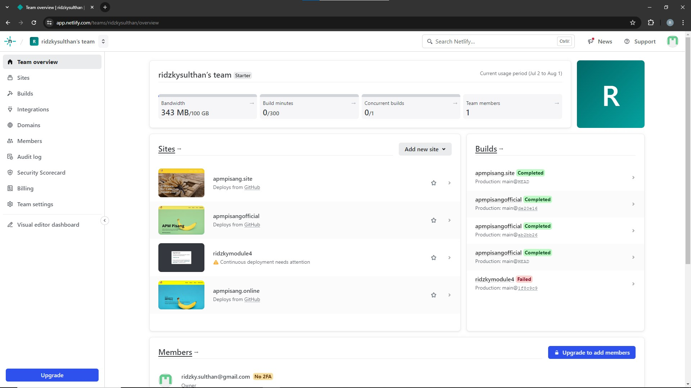

2. Click domains and Type in the custom domain that you have purchased before 
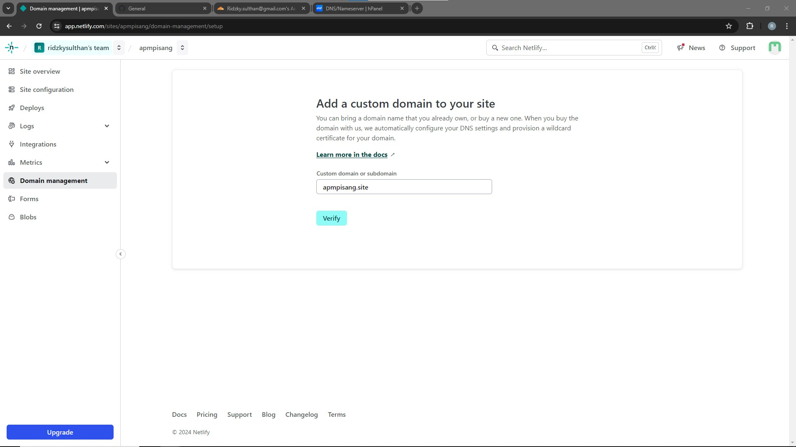

4. Invalid configuration will appear like this
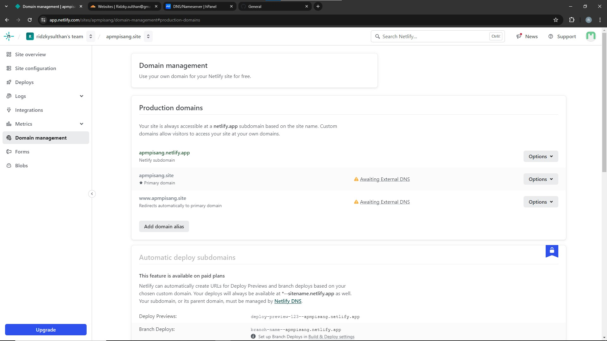

5. After that open cloudflare website and login [link](https://www.cloudflare.com/) 
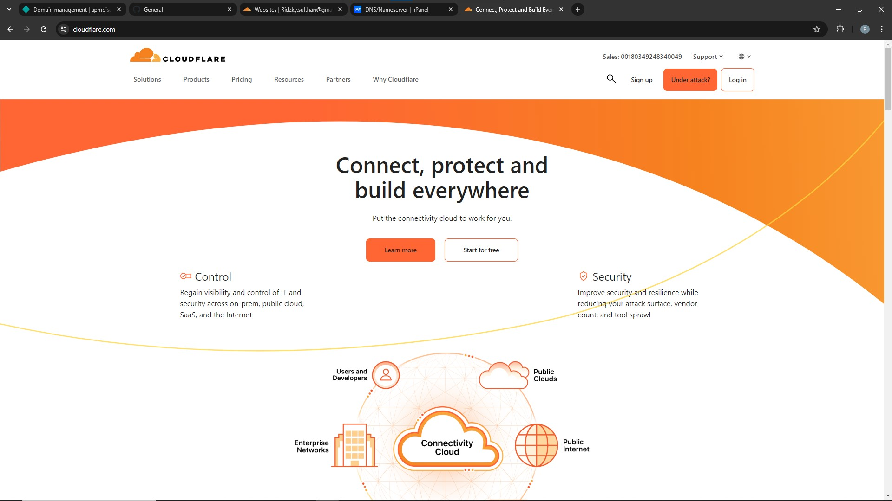

6. Search website name and input the custom domain that you have purchased before
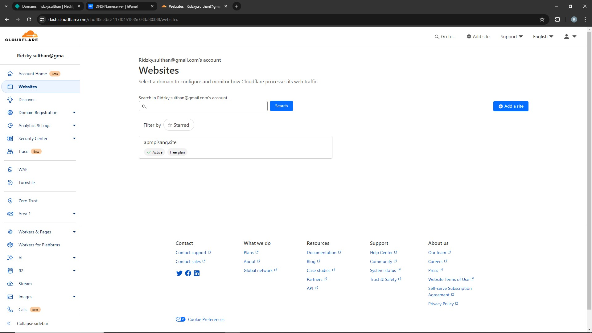

7. Copy the nameservers
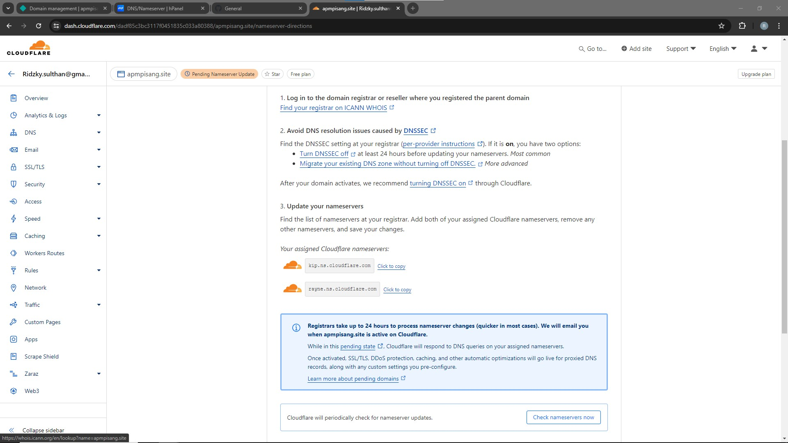

8. Input nameservers in niagarahoster
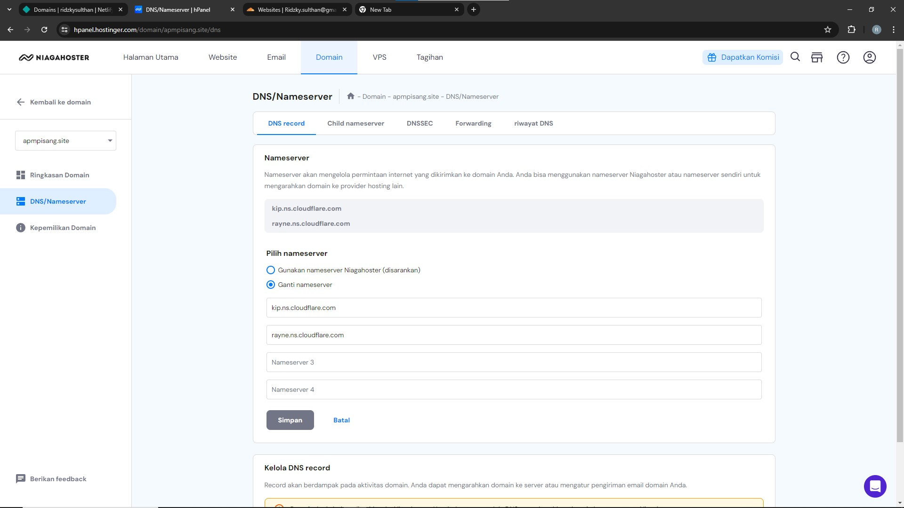

8. Setting the ip address obtained from NSlookup and click save.
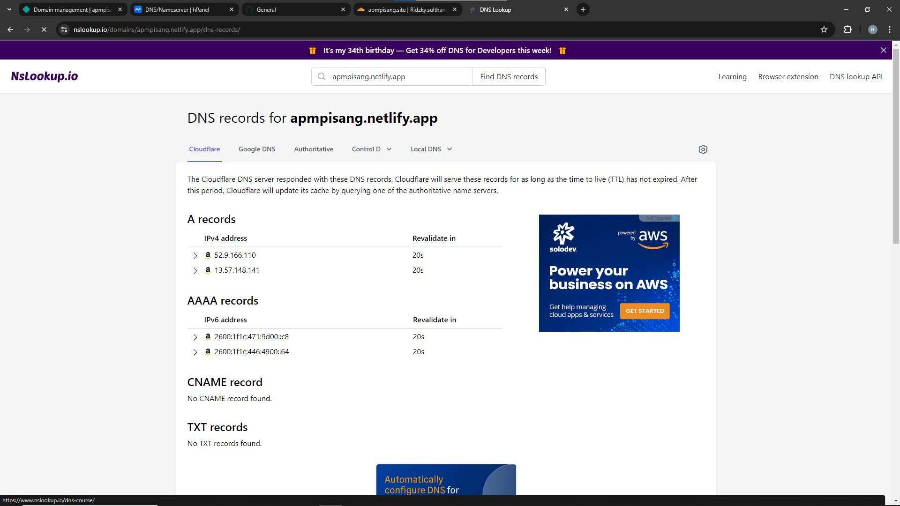
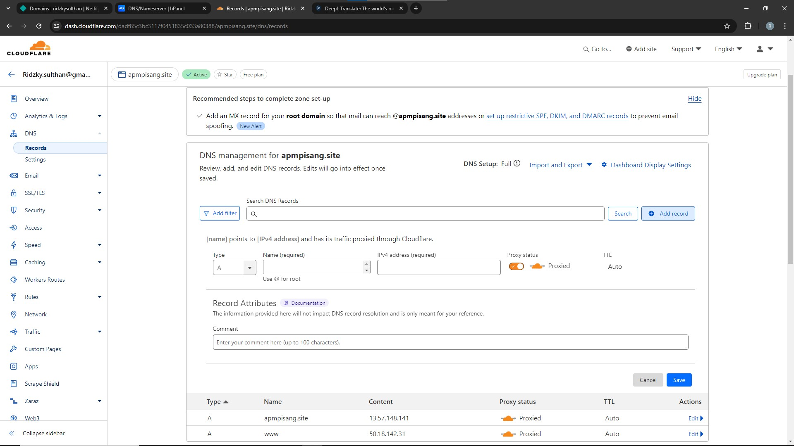

9. Done [link](https://apmpisang.site/) 🍌🍌
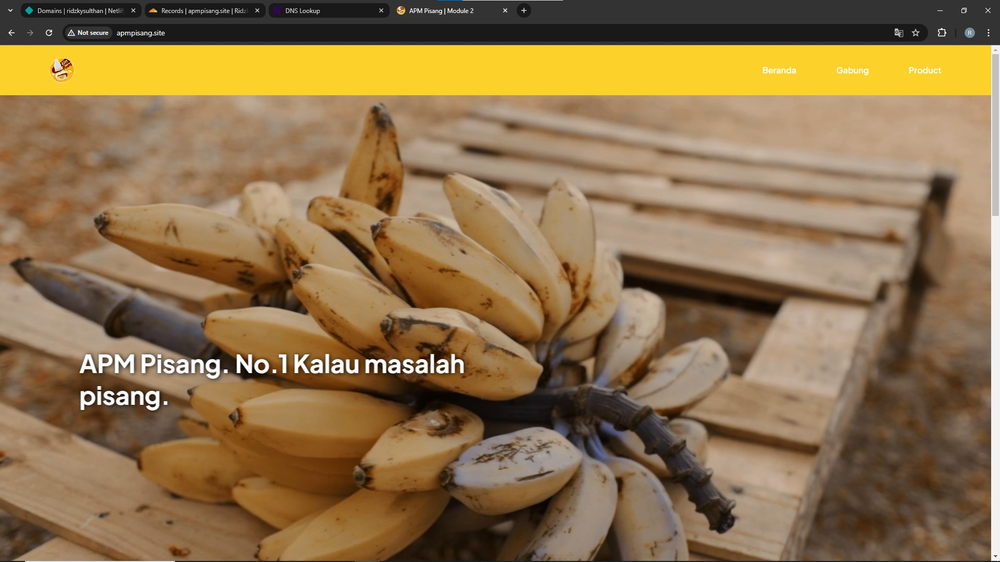